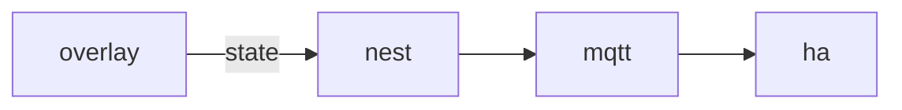

# Nest

**Smart Home Bridge** — A planned home-automation bridge that maps pet state to MQTT and Home Assistant scenes.

Part of [ComputerPets](https://github.com/RicheyWorks/computerpets). Map: [computerpets-ecosystem](https://github.com/RicheyWorks/computerpets-ecosystem).

[Status](#status) · [Contract](docs/CONTRACT.md) · [Contributor start](#contributor-start) · [Ecosystem](https://github.com/RicheyWorks/computerpets-ecosystem)

| Project | At a glance |
| --- | --- |
| Status | Design scaffold; not runnable yet |
| License | MIT |
| First pet | [Flagship start guide](https://github.com/RicheyWorks/computerpets/blob/main/docs/START-HERE.md) |

## Status

This repository contains a [contract](docs/CONTRACT.md) and a [source placeholder](src/nest/index.ts). It has no runnable application, build manifest, automated tests, or CI workflow.

The experience, interfaces, integrations, and safeguards below are **implementation plans**, not supported features. The first implementation slice defines the initial contribution target.

## Planned role

Rui sleeps, the room follows. Nest is opt-in and local-first. No vendor cloud required if you already run MQTT.

For the desktop pet, start with the [flagship guide](https://github.com/RicheyWorks/computerpets/blob/main/docs/START-HERE.md).

## Intended audience

Players with MQTT or Home Assistant. Opt-in, local-first.

## Out of scope

Not a lock/camera controller. Never drives security hardware.

## Proposed integration



## Planned stack

TypeScript · MQTT · Home Assistant discovery · optional Hue / Matter bridge

GroupId / namespace: `com.enterprisepet.nest`  
Proposed listen surface: `1883 / 8123`

## Proposed contract

### Data

`Home(id, mqttUrl) · Binding(petId, entityId) · Scene(sleepDim, hungryWarm)`

### Surface

- MQTT computerpets/{petId}/state — sleep|hungry|play
- HA discovery: binary_sensor.pet_asleep, light.pet_den
- POST /v1/pair — local token for this home

### Planned safeguards

Broker down → overlay unaffected. Wrong room scene → one-click disable in tray. Never drive locks or cameras.

## First implementation slice

Initial implementation target:

**Publish `sleep|hungry|play` and HA discovery for `binary_sensor.pet_asleep`.**

Acceptance targets: Broker down: overlay unaffected. One-click disable in the tray. No camera topics.

## Planned environment

`MQTT_URL`, `HOME_TOKEN`

Never commit secrets. Never put Steam or chain keys in the overlay.

## Related projects

- [computerpets](https://github.com/RicheyWorks/computerpets) desktop vitals
- [computerpets-wallpaper](https://github.com/RicheyWorks/computerpets-wallpaper)
- [computerpets-telemetry](https://github.com/RicheyWorks/computerpets-telemetry) (anonymous pulses only)

## Layout

```
computerpets-nest/
  README.md           this file
  LICENSE             MIT
  docs/CONTRACT.md    the same contract, frozen for implementers
  src/                implementation lands here
```

## Contributor start

With Git and PowerShell, clone the scaffold and read its contract and source marker:

```powershell
git clone https://github.com/RicheyWorks/computerpets-nest.git
Set-Location computerpets-nest
Get-Content .\docs\CONTRACT.md
Get-Content .\src\nest\index.ts
```

Start with the [first implementation slice](#first-implementation-slice). Add the minimum project setup and tests needed for that slice, then document verified run commands. The proposed stack above is a design choice; there is no install or launch command for this checkout yet.

## Links

- Flagship: [RicheyWorks/computerpets](https://github.com/RicheyWorks/computerpets)
- This repo: [RicheyWorks/computerpets-nest](https://github.com/RicheyWorks/computerpets-nest)
- Map: [RicheyWorks/computerpets-ecosystem](https://github.com/RicheyWorks/computerpets-ecosystem)
- Contract file: [docs/CONTRACT.md](docs/CONTRACT.md)

## License

MIT. See [LICENSE](LICENSE).

---

*Two hundred ten living kinds. Keep them so a line does not go quiet.*
