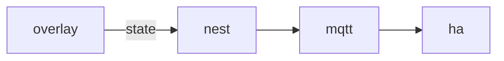

# Nest

**Smart Home Bridge** — Links pet behavior to IoT devices — lights dim when the pet sleeps, a lamp warms on hungry.

Part of [ComputerPets](https://github.com/RicheyWorks/computerpets). Map: [computerpets-ecosystem](https://github.com/RicheyWorks/computerpets-ecosystem).

| | |
| --- | --- |
| Status | Design scaffold — contract frozen, implementation next |
| License | MIT |
| First pet | Still [Rui on the desktop](https://github.com/RicheyWorks/computerpets/blob/main/docs/START-HERE.md). This organ is optional. |

## The job

Rui sleeps, the room follows. Nest is opt-in and local-first. No vendor cloud required if you already run MQTT.

The flagship overlay already puts a living sticker on the real desktop (Rui first, 210 kinds). Nest does not replace that. It is one organ.

## Who uses it

Players with MQTT or Home Assistant. Opt-in, local-first.

## What it is not

Not a lock/camera controller. Never drives security hardware.

## Architecture



## Stack

TypeScript · MQTT · Home Assistant discovery · optional Hue / Matter bridge

GroupId / namespace: `com.enterprisepet.nest`  
Default listen: `1883 / 8123`

## Contract

### Data

`Home(id, mqttUrl) · Binding(petId, entityId) · Scene(sleepDim, hungryWarm)`

### Surface

- MQTT computerpets/{petId}/state — sleep|hungry|play
- HA discovery: binary_sensor.pet_asleep, light.pet_den
- POST /v1/pair — local token for this home

### Failure doctrine

Broker down → overlay unaffected. Wrong room scene → one-click disable in tray. Never drive locks or cameras.

## First slice

Build this and stop. Do not boil the ocean.

**Publish `sleep|hungry|play` and HA discovery for `binary_sensor.pet_asleep`.**

You know it works when: Broker down: overlay unaffected. One-click disable in the tray. No camera topics.

## Environment

`MQTT_URL`, `HOME_TOKEN`

Never commit secrets. Never put Steam or chain keys in the overlay.

## Neighbors

- computerpets desktop vitals
- computerpets-wallpaper
- computerpets-telemetry (anonymous pulses only)

## Layout

```
computerpets-nest/
  README.md           this file
  LICENSE             MIT
  docs/CONTRACT.md    the same contract, frozen for implementers
  src/                implementation lands here
```

## Run (Windows)

PowerShell, from this folder, after the flagship helpers (Git, Node LTS 22+, JDK 21 as needed):

```powershell
cd bridge; npm install; npm run start
```

You do not need this service to meet Rui. The [flagship start-here](https://github.com/RicheyWorks/computerpets/blob/main/docs/START-HERE.md) is still the first pet.

## Links

- Flagship: [RicheyWorks/computerpets](https://github.com/RicheyWorks/computerpets)
- This repo: [RicheyWorks/computerpets-nest](https://github.com/RicheyWorks/computerpets-nest)
- Map: [RicheyWorks/computerpets-ecosystem](https://github.com/RicheyWorks/computerpets-ecosystem)
- Contract file: [docs/CONTRACT.md](docs/CONTRACT.md)

## License

MIT. See [LICENSE](LICENSE).

---

*Two hundred ten living kinds. Keep them so a line does not go quiet.*
